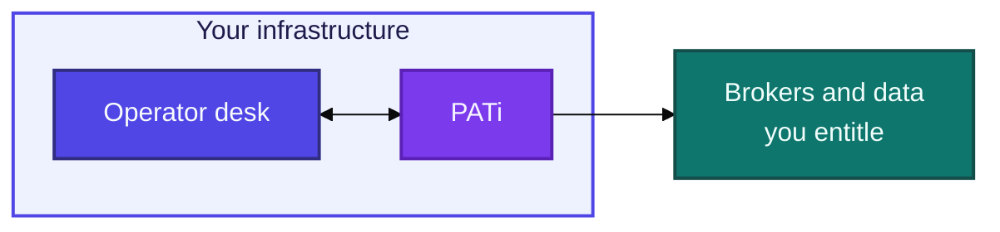
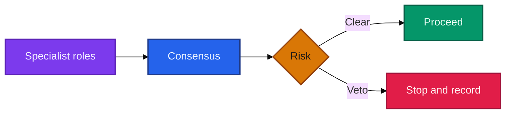
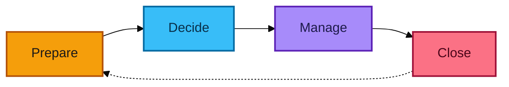
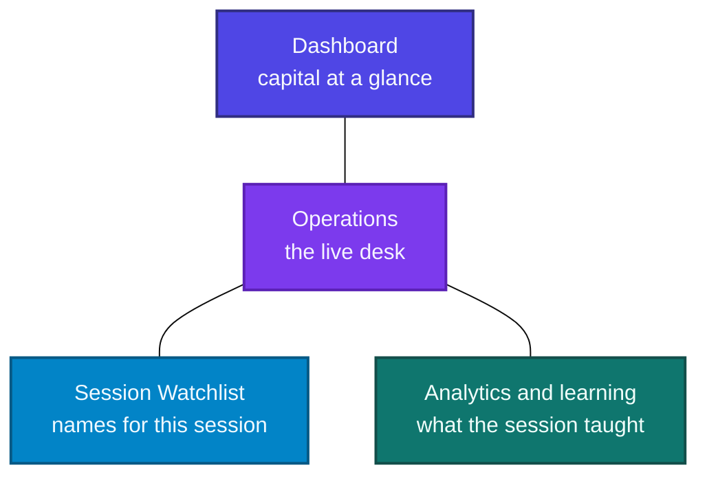

# PATi

### Private Algorithmic Trading

A self-hosted desk for **equities, options, and crypto**.  
Research, decisions, and history stay on **your** infrastructure.

---

## Where it sits

You keep the desk. Venues stay connections you choose. Intelligence can run beside it, on your hardware.

---

## How a decision moves

Ideas and permission are separate. Risk can say no.

---

## How a session moves

One rhythm, across sessions: prepare, decide, manage, close.

---

## What you operate

```mermaid
%%{init: {"theme": "base", "flowchart": {"curve": "basis"}}}%%
flowchart LR
  P["Posture"] --- B["Book"] --- K["Brokers"] --- M["Markets"] --- A["Automation"] --- H["Health"] --- Q["Quality"]

  style P fill:#4F46E5,stroke:#312E81,stroke-width:2px,color:#F8FAFC
  style B fill:#7C3AED,stroke:#5B21B6,stroke-width:2px,color:#F5F3FF
  style K fill:#0F766E,stroke:#134E4A,stroke-width:2px,color:#F0FDFA
  style M fill:#0284C7,stroke:#075985,stroke-width:2px,color:#F0F9FF
  style A fill:#D97706,stroke:#92400E,stroke-width:2px,color:#1C1917
  style H fill:#E11D48,stroke:#9F1239,stroke-width:2px,color:#FFF1F2
  style Q fill:#0EA5E9,stroke:#0369A1,stroke-width:2px,color:#082F49
```

The book holds equities, options, and crypto. Ask PATi what is true on the desk right now.

| | |
| --- | --- |
| **Custody** | Your machines. Your history. |
| **Governance** | Specialists propose. Risk can veto. |
| **Rhythm** | A full session, not a one-off alert. |
| **Evidence** | Blocks and fills leave a trail. |

PATi does not promise returns.

---

Trading can lose money. You own compliance, market-data rights, and broker terms. 
This page is not investment advice.

**Shared Oxygen, LLC** · September 2026

